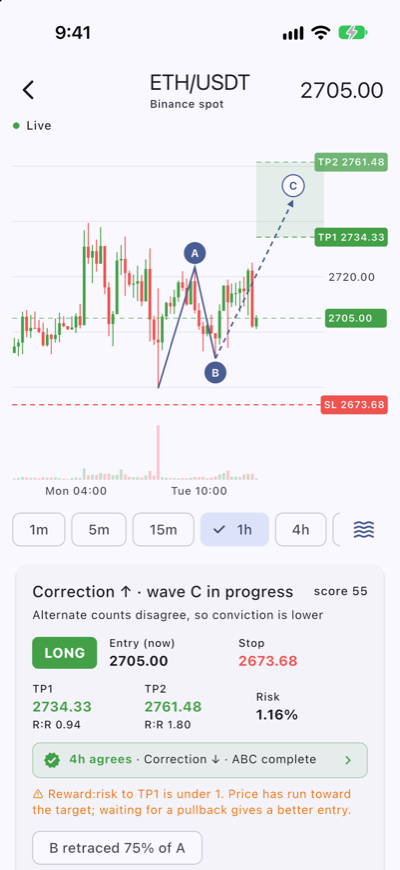
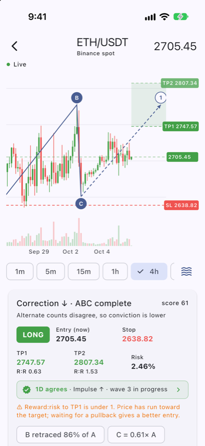
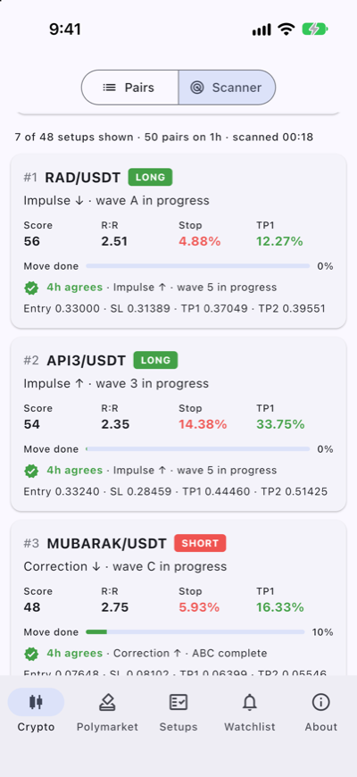
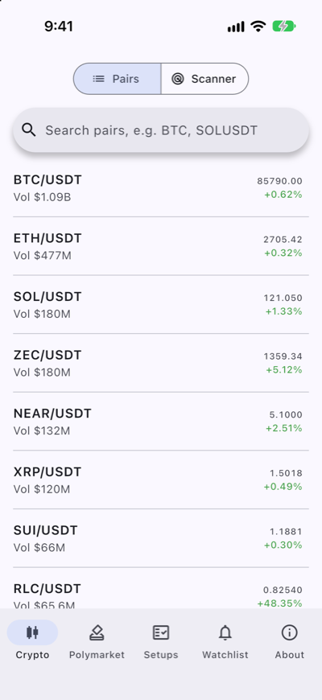
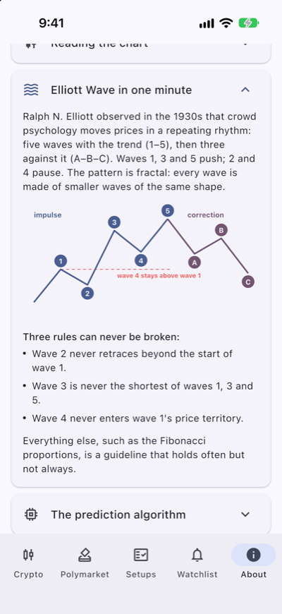
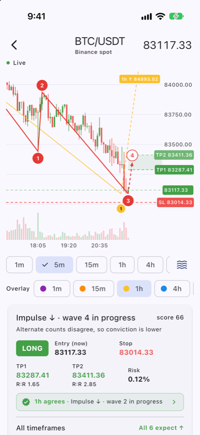

# Tantya

**An Elliott Wave trading companion for Android, iOS, Windows and macOS.**

Open the pair you're trading on Binance and Tantya shows the same live
candlestick chart with an algorithmic wave count drawn on it. It projects the next
wave and turns that into a trade setup: bias, entry, stop, TP1/TP2 and
reward:risk. Polymarket prediction markets are a second source that runs on the
same engine.

No account, wallet or API key is needed. It reads public market data only and
never places orders. *It is an analysis tool, not financial advice.*

<table>
  <tr>
    <td align="center"><br><sub><b>Live chart + setup</b><br>count, projection, SL/TP, 4h check</sub></td>
    <td align="center"><br><sub><b>Any timeframe</b><br>4h: correction done, new wave 1</sub></td>
    <td align="center"><br><sub><b>Scanner</b><br>best setups across the top pairs</sub></td>
  </tr>
  <tr>
    <td align="center"><br><sub><b>Pairs</b><br>Binance spot by 24h volume</sub></td>
    <td align="center"><br><sub><b>About</b><br>how to use it, and the algorithm</sub></td>
    <td align="center"><br><sub><b>Timeframe overlays</b><br>5m red + 1h yellow on one chart</sub></td>
  </tr>
</table>

<sub>Screenshots from the iPhone simulator (iOS 27) with live Binance data on
2026-10-07. Android, Windows and macOS run the same Flutter code.</sub>

## What it does

- **Live chart with the prediction drawn on it**: wave labels on the swings, a
  dashed projection of the next wave into the empty space on the right, the target
  zone, and SL / TP1 / TP2 on the price axis.
- **Trade setup** from the best count: LONG/SHORT, entry, an ATR-buffered stop,
  two targets and reward:risk, plus the alternate counts.
- **Higher-timeframe check**: does the 4h agree with your 1h setup?
- **Timeframe overlays**: other timeframes' counts drawn on the same chart, one
  colour each (5m red, 1h yellow, …), with their target overlaps (confluence)
  outlined, and an "All timeframes" table showing how many point which way.
- **Scanner** across the top 30/50/100 pairs, and **background alerts** for fresh
  setups.
- **Track record**: tracked setups are settled at their target or stop, and
  scored in R per timeframe and by higher-timeframe agreement, so you can see
  whether the method actually works.
- **MACD**: a momentum pane under the chart, read against the wave count (does
  wave 3 carry the most momentum? does wave 5 diverge?), and whether momentum
  backs the setup.
- **Desktop**: a big chart with the setup beside it, a side navigation rail,
  mouse-wheel zoom and a crosshair that follows the pointer.

## Tabs

- **Crypto**: two views.
  - **Pairs**: Binance spot pairs by 24h volume (stablecoin pairs and leveraged
    tokens hidden), with search across every symbol.
  - **Scanner**: runs the EW engine on the top 30/50/100 USDT pairs for one
    timeframe and ranks their setups. Tapping a result opens the pair on that
    timeframe. See *Scanner* below.
- **Polymarket**: trending prediction markets, categories and search. A market
  opens on the same live chart and wave count, per outcome.
- **Setups**: setups you chose to track, settled against real prices, with a
  track record (hit rate and average R).
- **Watchlist**: Polymarket price alerts (moves ±N points, level crossings, close).
- **About**: what the app does, a step-by-step guide to using it while trading, a
  chart legend, a one-minute Elliott Wave primer with a diagram, the full
  prediction algorithm, setup and track-record rules, limitations, data sources
  and a disclaimer. The swing sensitivities, Fibonacci table, stop buffer and
  expiry are read from the engine's constants. The projection table is
  hand-written, so keep it in step with `_impulse` / `_correction`.

## The chart (`lib/screens/live_chart.dart`)

A custom painter, not a chart library, so the prediction can be drawn in empty
space right of the last candle:

- live candles and volume; drag to pan, pinch to zoom, long-press for an OHLC
  crosshair, double-tap to reset
- the wave count: a zigzag through the labelled swings (1–5, A–C)
- the projected next wave: a dashed arrow to the middle of the target zone
- the target zone band, plus SL / TP1 / TP2 / last-price tags on the price axis

## How the wave count works (`lib/elliott.dart`)

1. **Swings**: zigzag pivots at four sensitivities (5/8/12/18% of the visible
   range). Each sensitivity is roughly a wave degree.
2. **Candidates**: every impulse (1–5, then A–B–C after it) and standalone A–B–C
   ending at the latest swing. Each is read two ways: the last swing ended a wave,
   or it is still part of the wave in progress.
3. **Hard rules** reject a count: wave 2 retraces past wave 1's start, wave 3 doesn't
   pass wave 1, wave 4 overlaps wave 1, or wave 3 is the shortest of 1/3/5.
4. **Score**: how close the ratios are to the Fibonacci guidelines (W2 50/61.8%,
   W3 1.618/2.618/1×, W4 23.6/38.2/50%, W5 0.618/1/1.618×, B 38–79%, C 0.618/1/1.618×),
   plus alternation. This is multiplied by completeness, because more confirmed
   waves means less guessing. **The score says how textbook the count is, not how
   likely it is.**
5. **Size discount**: a count should span at least 8% of the chart's candles
   (minimum 12) and 25% of its price range. Size = √(span fit × amplitude fit),
   and score = fit × (0.3 + 0.7 × size). This stops a three-candle A-B-C inside a big
   trend from outranking the trend. Counts with size < 0.5 get a "Small count" note.
   Measured on the top 50 pairs on 1h, primary counts under 10 candles went from
   15 to 2, and the median span from ~21 to 37 candles. Rerun with
   `dart run tool/count_sizes.dart 1h 50`.
6. **Projection** for the wave in progress: a Fibonacci target zone and an
   invalidation level. Counts already invalidated, or whose target is already
   behind price, are dropped.

The top count is primary, and up to four alternates are listed and can be chosen
on the chart.

## Multi-timeframe agreement (`lib/mtf.dart`)

Each timeframe is checked one degree up: 1m→15m, 5m→1h, 15m→1h, 1h→4h, 4h→1D.
1D has no higher timeframe. The higher timeframe's primary count *agrees* when it
expects the same direction as the setup, *conflicts* when it expects the opposite,
and is *unknown* when there is no count.

- **Chart**: a badge under the setup ("✓ 4h agrees · Impulse ↑ · wave 3…" or
  "⚠ 4h expects ↓…"). It refreshes every 5 minutes, and tapping it switches the
  chart to the higher timeframe.
- **Scanner**: one extra request per pair with a setup. Rank × 1 / 0.85 / 0.6 for
  agree / unknown / conflict. The "4h agrees" filter is on by default.
- **Background alerts**: "higher TF must agree" follows that filter (on by default)
  and doubles the data estimate. Alerts saved before this feature keep it off.
- **Track record**: tracked setups store the verdict, and the scorecard compares
  hit rate and average R for *agreed* vs *against*. That's the evidence for
  whether the check helps.

## Timeframe overlays & confluence (`lib/layers.dart`)

Every timeframe has a fixed colour everywhere in the app: **1m purple, 5m red,
15m orange, 1h yellow, 4h blue, 1D teal**. The chart's own count uses its
timeframe's colour.

- **Overlay chips** under the timeframes draw other timeframes' counts on the
  chart: their swings, labels, projected next wave and target band, thinner than
  the chart's own. Points are placed **by time** (`indexAt`), so a 1h count lines
  up on a 5m chart and the other way round. The next-higher timeframe is on by
  default and follows timeframe changes until you pick overlays yourself.
- **Off-screen targets**: a longer timeframe's target is often outside a short
  chart's price range, so it is pinned as a coloured marker to the top or bottom
  edge ("1h ↑ 84,893").
- **Confluence** (`findConfluence`): where two shown timeframes' target zones
  overlap *and* expect the same direction, the overlap is outlined on the chart
  ("5m+15m ↑"). Pairs spanning more degrees are listed first.
- **All timeframes table** in the setup card: each timeframe's count as
  "↑ wave 4 of impulse ↓" (the arrow is the expected next move; the structure's own
  direction is in the text), its target, alignment ("All 6 expect ↑" or
  "4 expect ↑ · 2 ↓"), and the confluences. Tap a row to toggle its overlay.

Opening a chart now counts every timeframe (about six history requests, then a
recount every 5 minutes). The same data feeds the higher-timeframe badge.

## MACD (`lib/indicators.dart`)

Standard MACD (12, 26, 9): EMAs seeded with a simple average, signal = EMA(9) of
MACD, histogram = MACD − signal. The pane under the chart shows histogram bars
(paler while shrinking), the MACD line (dark) and the signal line (grey), in
neutral colours because the timeframe overlays use red, orange, yellow and blue.
Toggle it with the line-chart icon. The crosshair shows MACD and signal values.

The setup card's **MACD** section reads it three ways:

- **State**: bullish or bearish (histogram above or below zero), rising or
  falling, and a recent cross.
- **Does momentum back the setup?** *Backs* (histogram on the trade's side),
  *turning* (wrong side but moving toward it) or *against*.
- **Against the wave count** (`macdNotes`), measuring each wave's momentum as the
  MACD line's extreme during that wave:
  - wave 3 should be the momentum peak among waves 1, 3 and 5 (✓, or ⚠ if not);
  - wave 5 past wave 3 on weaker MACD is **divergence**, the classic sign an
    impulse is ending (✓); no divergence means it may extend (⚠); while wave 5 is
    still running, "divergence building" is an early warning;
  - wave C past wave A on weaker MACD is typical as a correction ends (✓); a
    stronger C means it may not be finished (⚠).

**MACD doesn't change scores or setups yet.** Each tracked setup records the MACD
verdict, and the Setups tab's **By MACD momentum** table compares results for
*backed* / *turning* / *against*. Folding MACD into the ranking should wait until
that comparison shows it helps.

## Trade setups (`lib/setup.dart`)

- **Bias** is the direction of the wave in progress. **Entry** is the current price.
- **Stop** sits at the invalidation level plus a buffer of ½ ATR(14), so a wick
  to the exact wave extreme doesn't stop it out. When invalidation is on the
  target side (wave 2, wave 4), the stop goes at the start of the wave in
  progress instead.
- **TP1/TP2** are the near and far edges of the target zone. A setup with R:R
  under 1 to TP1 gets a warning.

**Track record splits:** the Setups tab breaks results down **by timeframe**
(closed and open counts, hit rate and average R per timeframe) and **by
higher-timeframe verdict**. Timeframe chips filter both the list and the whole
scorecard, so you can ask questions like "do 1h setups that 4h agreed with
actually pay?". `Scorecard.groupBy` builds both splits; each group is itself a
`Scorecard`.

**Tracking:** a tracked setup settles at whichever it touches first, TP1 or the
stop. If one candle spans both, it counts as stopped, which is the conservative
choice. After 50 candles of its timeframe it expires at the market price. Results
are in R (multiples of the risk). Checks run when the Setups tab opens and in the
background job, which notifies when a setup closes.

## Scanner (`lib/scanner.dart`)

`evaluatePair()` runs the chart's exact pipeline on each pair: `analyze` → primary
count → `TradeSetup.from` with the ATR stop buffer. A scan result is therefore
always the setup you see when you open the chart. Pairs are ranked by:

```
rank = score × min(R:R to TP1, 3)/3 × (1 − ½·progress) × (1 if counts agree else 0.8)
       × higher-timeframe factor (agree 1, unclear 0.85, conflict 0.6)
```

`progress` is how much of the way from the wave's start to TP1 price has already
travelled, so fresh setups rank above ones that have mostly played out. Results
can be filtered by long/short, R:R ≥ 1.5 and agreeing counts. Candles are fetched
6 pairs at a time (50 pairs on 1h take about 10 seconds); a new scan, or leaving
the screen, cancels the one running.

### Background alerts (`lib/scan_alerts.dart`)

"Alert me about new setups like these" saves the scanner's current settings
(timeframe 15m–1D, top N, long/short, R:R, agreeing counts) plus two of its own:
**score ≥ 60** and **under 50% of the move done**. The background job (every
15 minutes on Android) then:

- scans **at most once per candle** of that timeframe (skipped if the current
  candle was already scanned);
- reuses the top-pair list for a day, because the full ticker list is about 2 MB;
- notifies only setups not seen before. A setup is keyed by
  `symbol|frame|side|wave|wave-start time`. Times are used, not candle indexes,
  because indexes shift as candles arrive. Seen keys are kept for 3 days;
- sends one notification for each of the best three new setups (tapping opens
  that pair on that timeframe), plus a summary when there are more (tapping
  opens the scanner).

Estimated data use is shown on the card: about 15 KB gzipped per pair per scan.
5m is excluded because the job can't run more often than every 15 minutes (on
iOS, far less often; see *iOS*).

Crypto pairs are highly correlated, so one market-wide swing often produces the
same pattern on many pairs at once. Ten "SHORT · ABC complete" results are closer
to one trade than ten.

## Data sources (`lib/sources/`)

| | History | Live |
|---|---|---|
| Binance | `data-api.binance.vision/api/v3/klines` (real OHLCV, 300 candles) | `wss://data-stream.binance.vision/ws/<sym>@kline_<tf>` |
| Polymarket | CLOB `prices-history`, bucketed into candles (no OHLC exists) | market channel WebSocket: book, price_change, last_trade_price |

Both implement `CandleSource`, which the chart, the EW engine and the setup
tracker all depend on. Adding an exchange means adding one source.

Binance quirks: the `data-api` / `data-stream` hosts are market-data-only, need no
key and were reachable from the PH. The all-symbol 24h ticker is about 2 MB, so
it's fetched once per tab load.

Polymarket quirks (in `lib/api.dart`): `outcomes` / `outcomePrices` /
`clobTokenIds` are JSON strings inside the JSON. Placeholder markets
(`active: false`) and effectively settled ones are filtered out. Price-history
windows are capped at about 15 days.

**Polymarket may be blocked where you are.** On 2026-10-07 the Philippine ISP
Converge answered Polymarket's API hostnames with its own server (161.49.61.85)
instead of Cloudflare's. Its certificate can't match, so the TLS handshake fails.
The app reports "Your network or internet provider may be blocking it" instead
of a raw TLS error. It deliberately doesn't work around the block: such blocks
usually follow a regulator's order. The Binance side is unaffected.

## Build

Requires Flutter 3.47+, JDK 21 (`flutter config --jdk-dir <jdk21>`) for Android,
and Xcode for iOS (see *iOS*).

```bash
flutter test
flutter build apk --release
```

For a phone, build per-architecture (arm64 is about 19 MB vs 53 MB universal):

```bash
flutter build apk --release --split-per-abi
```

**Release signing:** `keystore.properties` and `keystore/tantya-release.jks` at the
repo root (both gitignored) sign release builds. Without them, e.g. on a fresh
clone, Gradle falls back to the debug key, and that APK **cannot update** a phone
running a release-signed install. **Back up both files somewhere other than this
laptop.** If they're lost, every install has to be uninstalled (losing tracked
setups) before a new build can go on.

## Desktop (Windows, macOS)

Same Flutter code. On windows at least 900 px wide the app uses a side navigation
rail. Chart screens at least 1000 px wide put the chart on the left (filling the
window) and the setup card on the right. On the chart, the mouse wheel zooms and
the crosshair follows the pointer. Tablets get the same layout.

- **Alerts run only while the app is open.** Desktop has no WorkManager-style
  scheduler for Flutter, so watchlist, setup and scanner checks run on a 15-minute
  timer inside the app (`isDesktop` / `_startDesktopChecks` in `lib/alerts.dart`).
  Minimised is fine; quitting stops them. Notifications use the system notification
  centre on each platform.
- **macOS**: universal (Intel and Apple Silicon), sandboxed with the
  `network.client` entitlement. Without that entitlement every request fails in
  release builds. It is ad-hoc signed, not notarized (that needs a paid Apple
  Developer account), so on first launch macOS blocks it: open
  **System Settings → Privacy & Security → Open Anyway** (or right-click → Open on
  older macOS).
- **Windows**: built only on GitHub Actions (`.github/workflows/desktop.yml`), since
  a Mac can't build Windows apps. Unsigned, so SmartScreen warns on first run
  (**More info → Run anyway**). Unzip and run `tantya.exe`; keep the DLLs and
  `data/` folder next to it.
- Window: opens at 1280×820, minimum 900×620 (`macos/Runner/MainFlutterWindow.swift`,
  `windows/runner/main.cpp`, and `WM_GETMINMAXINFO` in `win32_window.cpp`).
- Icons: `tool/render_icon.swift macos|windows` (the Windows `.ico` packs 16–256 px PNGs).

```bash
flutter build macos --release   # → build/macos/Build/Products/Release/Tantya.app
```

**CI** (`.github/workflows/desktop.yml`): every push to `master` builds Windows
(and runs the tests) and macOS, and keeps `tantya-windows-x64.zip` /
`tantya-macos.zip` as workflow artifacts. Pushing a tag like `v0.2.0` also
attaches them to a GitHub Release.

## iOS

**Status (2026-10-07):** builds with Xcode 27 and runs on the iPhone simulator,
where the live charts, wave counts, setups, scanner and the notification
permission flow were checked. An unsigned device build (arm64 release, 18 MB)
compiles. Not yet installed on a physical iPhone (needs signing), and a
background refresh hasn't yet been observed firing.

```bash
flutter build ios --simulator --debug     # Simulator
flutter build ios --release --no-codesign # device build, compile check only
```

**To install on an iPhone:** sign in to Xcode → Settings → Accounts with an Apple
ID, open `ios/Runner.xcworkspace`, set Runner → Signing & Capabilities → **Team**,
connect the phone (trust this Mac, enable Developer Mode), then
`flutter run --release`. A **free** Apple ID's installs stop opening after 7 days.
The paid developer program gives 1-year installs and TestFlight.

Plugins come in through Swift Package Manager (Flutter's default), so CocoaPods
is not needed, despite `flutter doctor`'s warning.

What's iOS-specific:

- `ios/Runner/AppDelegate.swift` registers the background task
  (`tantya.checkWatchlist`, the same name as `_taskName` in `lib/alerts.dart`) before
  `didFinishLaunching` returns, as the UIScene lifecycle requires. It also gives the
  background engine its plugins and makes notifications show in the foreground.
- `Info.plist`: `BGTaskSchedulerPermittedIdentifiers` and `UIBackgroundModes: fetch`.
  A task ID missing from that list crashes the app at launch, so a clean launch
  confirms the wiring.
- Notifications ask permission only when the user turns an alert on, never at launch
  (the background isolate also initialises them and can't prompt).
- **Background checks are much less frequent than on Android.** iOS runs
  `BGAppRefreshTask` when it decides to (often hourly or less, less still for rarely
  opened apps). In-app texts say so via `backgroundCadence` in `lib/alerts.dart`.
  Charts, counts, setups and the scanner are unaffected while the app is open.
- The app icon is a single 1024 px image rendered by `tool/render_icon.swift ios`
  (same design as Android, scaled up because iOS doesn't crop it to a safe zone).
- Apple verifies TLS certificates through the system trust store, more strictly
  than Android. That is why the Polymarket DNS block showed up on iOS first.

To force a background run while debugging (pause in Xcode, then in the lldb console):

```
e -l objc -- (void)[[BGTaskScheduler sharedScheduler] _simulateLaunchForTaskWithIdentifier:@"tantya.checkWatchlist"]
```

## Gotchas

- **Don't mix split and universal APKs on one phone.** `--split-per-abi` adds 1000×ABI
  to the version code (arm64 0.2.0 = 2003), but the universal APK keeps the plain
  code (3). Android treats universal-after-split as a downgrade and refuses to
  install it over the existing app. Phones should stay on the arm64 APK.

- `res/raw/keep.xml` keeps `@drawable/ic_notification`, which Dart refers to only
  by name. Without it the release shrinker deletes it and notification setup throws.
- WorkManager refuses to run a periodic job early, even with
  `cmd jobscheduler run -f`.
- Android serves SharedPreferences from memory, so editing the prefs XML with
  `run-as` while the app process is alive is invisible to the app. Kill the
  process first.
